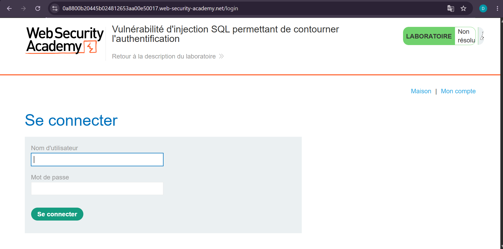
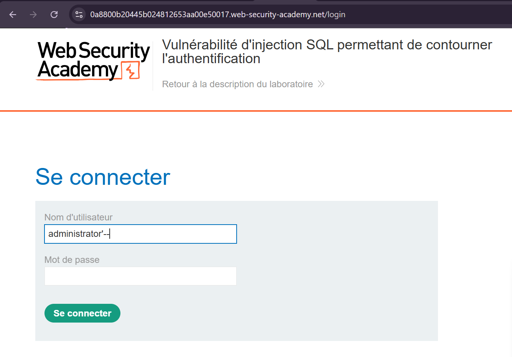
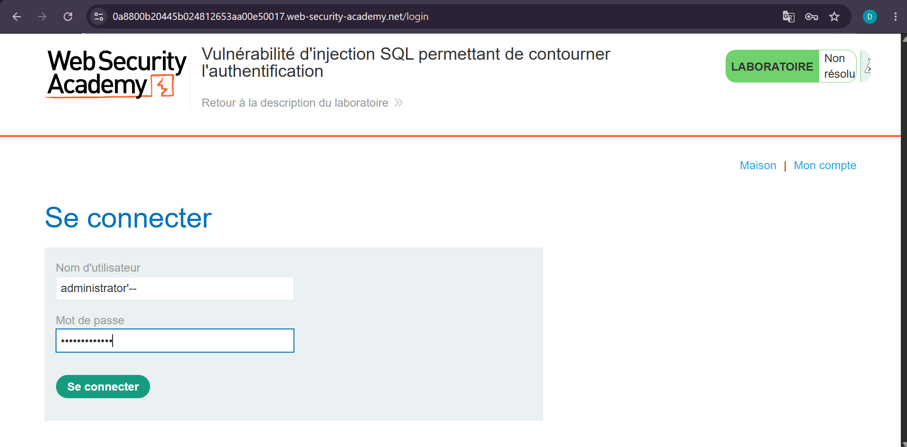
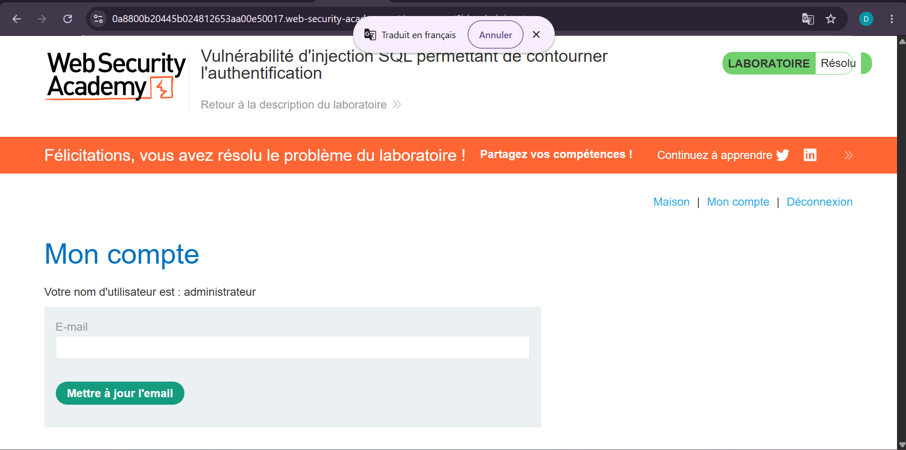

# Lab 2 — SQL Injection pour contourner l'authentification

**Source** : PortSwigger Web Security Academy  
**Titre du lab** : Vulnérabilité d'injection SQL permettant de contourner l'authentification  
**Statut** : ✅ Résolu

## Objectif

Exploiter une injection SQL dans le formulaire de connexion pour se connecter en tant qu'administrateur sans connaître son mot de passe.

## Contexte

Le formulaire de login construit une requête SQL en insérant directement les valeurs saisies dans les champs "Nom d'utilisateur" et "Mot de passe", sans validation ni échappement.

URL cible :https://0a8800b20445b024812653aa00e50017.web-security-academy.net/login
## Vulnérabilité

Injection SQL non filtrée dans le champ "Nom d'utilisateur" du formulaire de connexion, permettant de modifier la logique de la requête d'authentification.

## Exploitation

**Payload utilisé dans le champ "Nom d'utilisateur"** :administrator'--
**Mot de passe** : n'importe quelle valeur (ignorée grâce au commentaire SQL)

**Explication** :
- `administrator` cible le compte administrateur existant
- `'` ferme la chaîne de caractères dans la requête SQL
- `--` commente tout le reste de la requête, y compris la vérification du mot de passe

La requête backend, initialement de ce type :
```sql
SELECT * FROM users WHERE username = 'administrator' AND password = 'monmotdepasse'
```

devient :
```sql
SELECT * FROM users WHERE username = 'administrator'--' AND password = 'monmotdepasse'
```

La vérification du mot de passe est complètement ignorée, et la connexion s'effectue directement en tant qu'administrateur.

## Résultat

Connexion réussie en tant qu'**administrateur** sans connaître le mot de passe. Le lab a été marqué comme **Résolu**.

## Impact

Un attaquant peut contourner totalement le mécanisme d'authentification et accéder à n'importe quel compte, y compris les comptes administrateurs, sans connaître les mots de passe.

## Remédiation

- Utiliser des **requêtes préparées (prepared statements)** pour séparer le code SQL des données utilisateur
- Ne jamais concaténer directement les entrées utilisateur dans une requête SQL
- Mettre en place une **authentification multi-facteurs (MFA)** pour limiter l'impact d'un contournement

## Captures d'écran

**1. Page de login (avant exploitation)**


**2. Payload injecté dans le champ username**


**3. Formulaire avec mot de passe saisi**


**4. Lab résolu — connecté en tant qu'administrateur**

