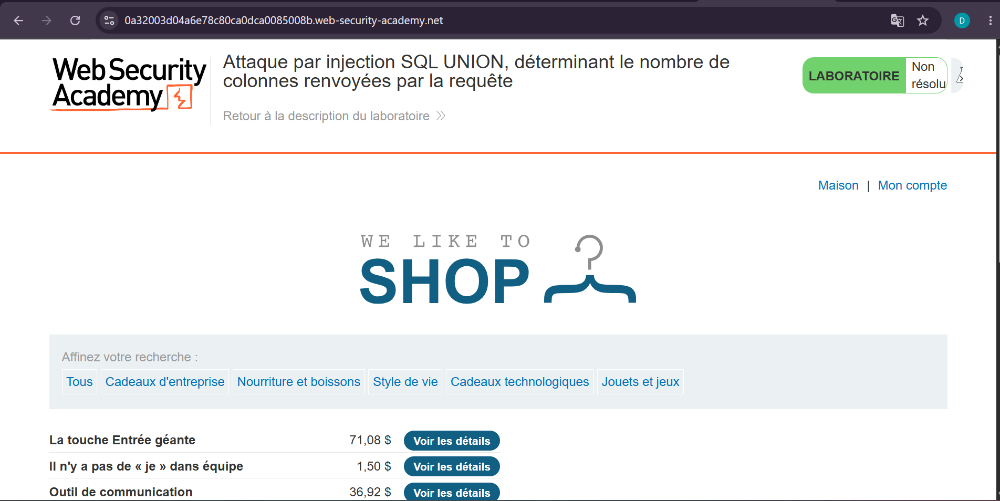
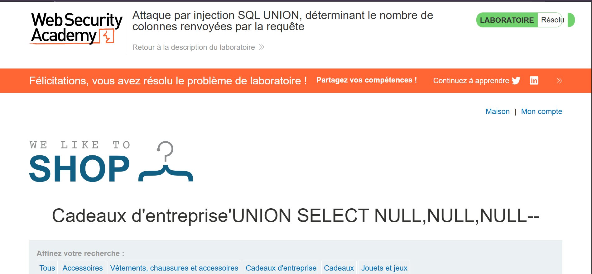

# Lab 3 — UNION Attack : déterminer le nombre de colonnes

**Source** : PortSwigger Web Security Academy
**Titre du lab** : Attaque par injection SQL UNION, déterminant le nombre de colonnes renvoyées par la requête
**Statut** : ✅ Résolu

## Objectif

Déterminer le nombre exact de colonnes renvoyées par la requête SQL originale, en utilisant une attaque UNION avec des valeurs NULL.

## Contexte

L'application filtre les produits par catégorie via le paramètre `category` dans l'URL. La requête SQL backend est vulnérable à une injection UNION, mais pour réussir l'attaque, il faut d'abord connaître le nombre exact de colonnes retournées.

URL cible : https://0a32003d04a6e78c80ca0dca0085008b.web-security-academy.net

## Vulnérabilité

Injection SQL dans le paramètre `category`, permettant d'injecter une clause UNION pour fusionner les résultats avec une requête arbitraire.

## Exploitation

**Principe** : On teste en ajoutant des NULL un par un jusqu'à ne plus avoir d'erreur.

**Tentative 1** (échec) : `'UNION SELECT NULL--`
→ Erreur : la requête originale ne retourne pas 1 colonne.

**Tentative 2** (échec) : `'UNION SELECT NULL,NULL--`
→ Erreur : la requête originale ne retourne pas 2 colonnes.

**Tentative 3** (succès) : `'UNION SELECT NULL,NULL,NULL--`
→ Succès : la requête originale retourne exactement **3 colonnes**.

**Explication** :
- `'` ferme la chaîne de caractères dans la clause WHERE
- `UNION SELECT NULL,NULL,NULL` fusionne une deuxième requête avec le même nombre de colonnes
- `NULL` est utilisé car il est compatible avec tous les types de données
- `--` commente le reste de la requête originale

## Résultat

Le lab a été marqué comme **Résolu**, confirmant que la requête originale retourne **3 colonnes**.

## Impact

Connaître le nombre de colonnes est la première étape d'une attaque UNION complète, qui permet ensuite d'extraire des données arbitraires de la base de données (autres tables, mots de passe, etc.).

## Remédiation

- Utiliser des **requêtes préparées (prepared statements)**
- Ne jamais exposer les messages d'erreur SQL à l'utilisateur
- Mettre en place un **WAF (Web Application Firewall)** pour détecter les tentatives d'injection

## Captures d'écran

**1. Page du lab (avant exploitation)**

**2. Lab résolu — payload UNION avec 3 NULL**

